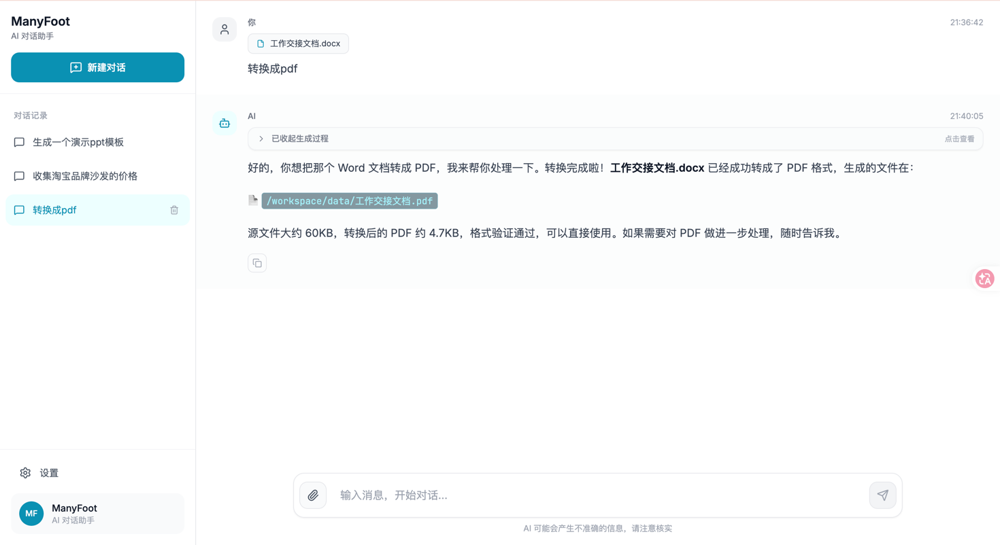

# ManyFoot

> 基于 Spring AI Alibaba Agent Framework 的 Supervisor 多智能体协作系统

ManyFoot 是一个可扩展的多智能体协作框架，采用 **Supervisor 模式** 协调 8 个智能体完成复杂任务。系统基于 Spring AI Alibaba Agent Framework 构建，支持多模型厂商、流式对话、文件上传、Docker 沙箱代码执行等能力。

## 核心特性

- **Supervisor 多智能体协作**：可扩展多个专业智能体协同工作，自动任务分解与调度
- **多模型厂商支持**：内置支持 Dashscope、OpenAI、Anthropic、DeepSeek、Gemini、Ollama、Qianfan 等
- **模型故障自动转移**：主模型失败时自动切换备用模型，保障服务稳定性
- **Docker 沙箱代码执行**：安全隔离的代码运行环境，支持 Python、JavaScript、Java 等多种语言
- **流式 SSE 响应**：实时输出思考过程和最终结果，低延迟交互体验
- **多模态文档分析**：支持图片理解、PDF/Office 文档提取、图表分析
- **可插拔架构**：新增智能体、工具、模型厂商均无需修改核心代码

## 技术栈

### 后端

| 技术 | 版本 | 用途 |
|------|------|------|
| Spring Boot | 3.4.4 | 应用框架 |
| Java | 17 | 运行时 |
| Spring AI | 1.1.2 | AI 抽象框架 |
| Spring AI Alibaba Agent Framework | 1.1.2.2 | ReactAgent 执行引擎 |
| Redisson | 3.45.1 | Redis 客户端 |
| Docker Java SDK | 3.3.4 | 沙箱容器管理 |
| Apache Tika | 3.2.2 | 文档解析 |
| Lombok | 1.18.42 | 代码简化 |

### 前端

| 技术 | 版本 | 用途 |
|------|------|------|
| React | 19.2.3 | UI 框架 |
| TypeScript | 5.8.2 | 类型系统 |
| Vite | 6.2.0 | 构建工具 |
| Tailwind CSS | CDN | 样式系统 |
| react-markdown | 10.1.0 | Markdown 渲染 |
| lucide-react | 0.562.0 | 图标库 |

## 系统架构

```text
┌─────────────────────────────────────────────────────────────┐
│                     Supervisor 协作流                         │
├─────────────────────────────────────────────────────────────┤
│                                                             │
│  ┌──────────────┐    ┌──────────────┐    ┌──────────────┐  │
│  │ PlannerRouter │───▶│  DomainSpec  │───▶│ ToolExecutor │  │
│  │   规划路由     │    │   领域专家    │    │   工具执行    │  │
│  └──────────────┘    └──────────────┘    └──────────────┘  │
│         │                   ▲                   │           │
│         │                   │                   ▼           │
│         ▼                   │            ┌──────────────┐  │
│  ┌──────────────┐           │            │   CodeAgent  │  │
│  │ ResearchRetr │───────────┘            │   代码执行    │  │
│  │   检索证据    │◀───────────────────────│              │  │
│  └──────────────┘                        └──────────────┘  │
│                                                             │
│  ┌──────────────┐                        ┌──────────────┐  │
│  │  DocumentSpec│                        │    Chat      │  │
│  │  文档专家     │                        │  多模态对话   │  │
│  └──────────────┘                        └──────────────┘  │
│                                                             │
│              ┌──────────────────────────┐                  │
│              │       Supervisor         │                  │
│              │    顶层编排调度智能体      │                  │
│              └──────────────────────────┘                  │
└─────────────────────────────────────────────────────────────┘
```

### 8 个智能体

| 智能体 | 职责 | 模型角色 |
|--------|------|----------|
| **SupervisorAgent** | 顶层编排：理解意图、分解任务、调度子智能体、综合结果 | SUPERVISOR |
| **PlannerRouterAgent** | 拆解目标、选择协作模式、定义完成标准 | PLANNER_ROUTER |
| **ResearchRetrievalAgent** | 检索证据、收集信息 | RESEARCH_RETRIEVAL |
| **DomainSpecialistAgent** | 领域专业知识处理（抽象基类） | DOMAIN_SPECIALIST |
| **DocumentSpecialistAgent** | 文档/需求专家：需求分析、文档草拟、验收标准 | DOMAIN_SPECIALIST |
| **ToolActionExecutorAgent** | 工具调用、动作执行 | TOOL_ACTION_EXECUTOR |
| **CodeAgent** | 编写、调试、运行代码，适用于数据分析、自动化脚本 | CODE |
| **ChatAgent** | 多模态文档分析助手：图片理解、文档提取、图表分析 | CHAT |

### 模型架构

```text
AiProvidersProperties (application.yml)
         ↓
  AiModelRegistrar (启动时注册)
         ↓
   ModelResolver (按角色解析)
         ↓
  FailoverChatModel (主备自动切换)
         ↓
     Agent 执行
```

## 项目结构

```text
ManyFoot/
├── pom.xml                          # Maven 构建配置
├── src/main/
│   ├── java/com/lh/manyfoot/
│   │   ├── ManyFootApplication.java         # 应用入口
│   │   ├── agent/
│   │   │   ├── core/                # 智能体核心接口
│   │   │   │   ├── Agent.java
│   │   │   │   ├── AbstractAgent.java
│   │   │   │   ├── AbstractToolAgent.java
│   │   │   │   ├── StreamingAgent.java
│   │   │   │   └── ToolAwareAgent.java
│   │   │   ├── context/             # 执行上下文
│   │   │   │   ├── AgentContext.java
│   │   │   │   ├── AgentAttachment.java
│   │   │   │   └── SessionContextHolder.java
│   │   │   ├── domain/              # 领域对象
│   │   │   │   ├── PlanGraph.java
│   │   │   │   ├── TaskSpec.java
│   │   │   │   ├── ActionCall.java
│   │   │   │   ├── ActionResult.java
│   │   │   │   └── DomainDraft.java
│   │   │   ├── factory/             # 智能体工厂
│   │   │   │   ├── AgentFactory.java
│   │   │   │   └── AgentType.java
│   │   │   ├── impl/                # 智能体实现
│   │   │   │   ├── SupervisorAgent.java
│   │   │   │   ├── PlannerRouterAgent.java
│   │   │   │   ├── ResearchRetrievalAgent.java
│   │   │   │   ├── DomainSpecialistAgent.java
│   │   │   │   ├── DocumentSpecialistAgent.java
│   │   │   │   ├── ToolActionExecutorAgent.java
│   │   │   │   ├── CodeAgent.java
│   │   │   │   └── ChatAgent.java
│   │   │   ├── prompt/              # 提示词提供者
│   │   │   ├── registry/            # 智能体注册表
│   │   │   ├── strategy/            # 执行策略
│   │   │   ├── supervisor/          # Supervisor 编排
│   │   │   ├── support/             # 工具类
│   │   │   └── tool/                # 工具提供者
│   │   │       ├── sandbox/         # Docker 沙箱
│   │   │       │   ├── SandboxTool.java
│   │   │       │   ├── SandboxEngine.java
│   │   │       │   └── SandboxContainerManager.java
│   │   │       └── ...
│   │   ├── models/                  # 模型层
│   │   │   ├── registry/            # 模型注册
│   │   │   ├── failover/            # 故障转移
│   │   │   └── support/             # 模型支持
│   │   ├── config/                  # 配置层
│   │   ├── controller/              # REST API
│   │   ├── service/                 # 基础设施服务
│   │   └── domain/                  # 共享 DTO / 枚举
│   └── resources/
│       ├── application.yml          # 唯一配置文件
│       └── Dockerfile               # 沙箱镜像
├── foot-ui/                         # 前端项目
│   ├── package.json
│   ├── vite.config.ts
│   ├── tsconfig.json
│   └── src/
│       ├── main.tsx
│       ├── App.tsx                  # 全局状态管理
│       ├── types.ts
│       ├── components/              # 展示组件
│       │   ├── ChatInput.tsx
│       │   ├── ChatMessage.tsx
│       │   ├── Sidebar.tsx
│       │   └── SettingsModal.tsx
│       └── services/
│           └── manyFootApi.ts       # API 客户端
├── docs/                            # 文档目录
└── AGENTS.md                        # AI 编程规范
```

## 快速开始

### 环境要求

- **JDK 17+**
- **Maven 3.8+**
- **Node.js 18+** & **npm**
- **Redis 6.0+**
- **Docker**（如需沙箱代码执行）

### 1. 克隆项目

```bash
git clone https://gitee.com/three-repairs/Many-Foot.git
cd ManyFoot
```

### 2. 配置应用

编辑 `src/main/resources/application.yml`：

```yaml
many-foot:
  ai:
    providers:
      qwen-max:
        vendor: dashscope
        model: qwen-max
        api-key: sk-your-api-key
        options:
          temperature: 0.3
    
    roles:
      SUPERVISOR:
        primary: qwen-max
        fallbacks: [qwen-plus]
      # ... 其他角色配置
    
    default-provider: qwen-max
  
  sandbox:
    enabled: true
    docker-host: tcp://localhost:2375

spring:
  data:
    redis:
      host: localhost
      port: 6379
```

### 3. 启动后端

```bash
# 编译
mvn clean package

# 运行（端口 8100）
mvn spring-boot:run
```

### 4. 启动前端

```bash
cd foot-ui
npm install
npm run dev
```

前端开发服务器运行在 `http://localhost:3000`，通过 Vite 代理连接后端。

## REST API

### 流式对话

```http
POST /api/chat/stream
Content-Type: application/json

{
  "sessionId": "uuid",
  "message": "你好，帮我写一个快速排序算法",
  "filePaths": ["uploads/example.pdf"]
}
```

**SSE 事件流：**

```text
event: phase
data: {"phase": "thinking"}

event: message
data: {"text": "我来帮你写快速排序算法..."}

event: done
data: {"sessionId": "uuid"}

event: error
data: {"error": "..."}
```

### 上传附件

```http
POST /api/chat/upload
Content-Type: multipart/form-data

file: <binary>
```

**响应：**

```json
{
  "path": "uploads/uuid-filename.pdf",
  "mimeType": "application/pdf",
  "type": "document"
}
```

## 配置指南

### 多模型厂商配置

支持通过配置接入多个模型厂商：

```yaml
many-foot:
  ai:
    providers:
      # 阿里云 Dashscope
      qwen-max:
        vendor: dashscope
        model: qwen-max
        api-key: sk-xxx
      
      # OpenAI
      gpt-4o:
        vendor: openai
        model: gpt-4o
        api-key: ${OPENAI_KEY}
      
      # DeepSeek
      deepseek-chat:
        vendor: deepseek
        model: deepseek-chat
        api-key: sk-xxx
      
      # 本地 Ollama
      local-llama:
        vendor: ollama
        model: llama3.1
        base-url: http://localhost:11434
      
      # 其他 OpenAI 兼容厂商
      custom-ai:
        vendor: openai-compatible
        model: custom-model
        base-url: https://api.custom.ai/v1
        api-key: sk-xxx
```

### 角色模型绑定

按智能体角色分配模型，支持主备故障转移：

```yaml
many-foot:
  ai:
    roles:
      SUPERVISOR:
        primary: qwen-max        # 主模型
        fallbacks: [qwen-plus, gpt-4o]  # 备用模型列表
      CODE:
        primary: qwen3-coder
        fallbacks: [deepseek-chat]
      CHAT:
        primary: qwen-vl-max     # 多模态模型
        fallbacks: [qwen-max]
```

### 沙箱配置

```yaml
many-foot:
  sandbox:
    enabled: true              # 是否启用沙箱
    docker-host: tcp://localhost:2375
    max-containers: 10         # 最大容器数
    timeout-seconds: 30        # 执行超时
```

## 扩展指南

### 添加新智能体

1. 在 `agent/impl/` 创建新类，继承 `AbstractAgent<R>` 或 `AbstractToolAgent<R>`
2. 实现 `getName()`、`getDescription()`、`getModelRole()` 方法
3. 在 `agent/prompt/` 创建对应的 `AgentPromptProvider`
4. 在 `AgentFactory` 中注册新类型
5. 在 `application.yml` 的 `roles` 中配置模型绑定

新增智能体会被 `AgentRegistry` 自动发现，Supervisor 编排层会自动将其暴露为可调度的工具。

### 添加新模型厂商

1. 在 `VendorEnums` 中添加枚举值
2. 在 `models/` 下创建 `XxxModelFactory` 实现 `AiModelFactory`
3. 使用 `@Component` 注解，确保 `supports()` 方法匹配 vendor code
4. 在 `application.yml` 中配置 provider

### 添加新工具

1. 在 `agent.tool` 相关包中定义工具能力
2. 通过 `AgentToolProvider` 提供工具实例
3. 定义清晰的输入输出 DTO
4. 工具异常必须转换为 Agent 可理解的失败结果

## 开发规范

- **架构分层**：Controller 只负责 API 入参出参，Agent 负责智能体行为，Models 负责模型适配，Tool 负责工具调用
- **面向接口编程**：跨模块调用必须通过接口、抽象类、工厂或服务完成
- **配置优先**：新能力优先通过配置开启或关闭，不硬编码
- **构造器注入**：使用构造器注入，不优先使用字段注入
- **中文注释**：为不直观的业务逻辑、算法决策、边界条件添加中文注释

完整开发规范请参阅 [AGENTS.md](./AGENTS.md)。

## 构建与部署

### 后端构建

```bash
# 开发构建
mvn clean package

# 跳过测试
mvn clean package -DskipTests

# 运行
java -jar target/ManyFoot-0.0.1-SNAPSHOT.jar
```

### 前端构建

```bash
cd foot-ui
npm run typecheck
npm run build
```

构建产物位于 `foot-ui/dist/`。

### Docker 部署

```bash
# 构建后端镜像
docker build -t manyfoot:latest .

# 运行
docker run -p 8100:8100 \
  -e SPRING_DATA_REDIS_HOST=redis \
  -e MANY_FOOT_AI_PROVIDERS_QWEN-MAX_API-KEY=sk-xxx \
  manyfoot:latest
```

## 许可证

[MIT](LICENSE)

---

> 让多智能体协作像走路一样自然 —— ManyFoot
